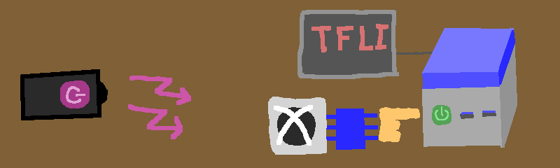
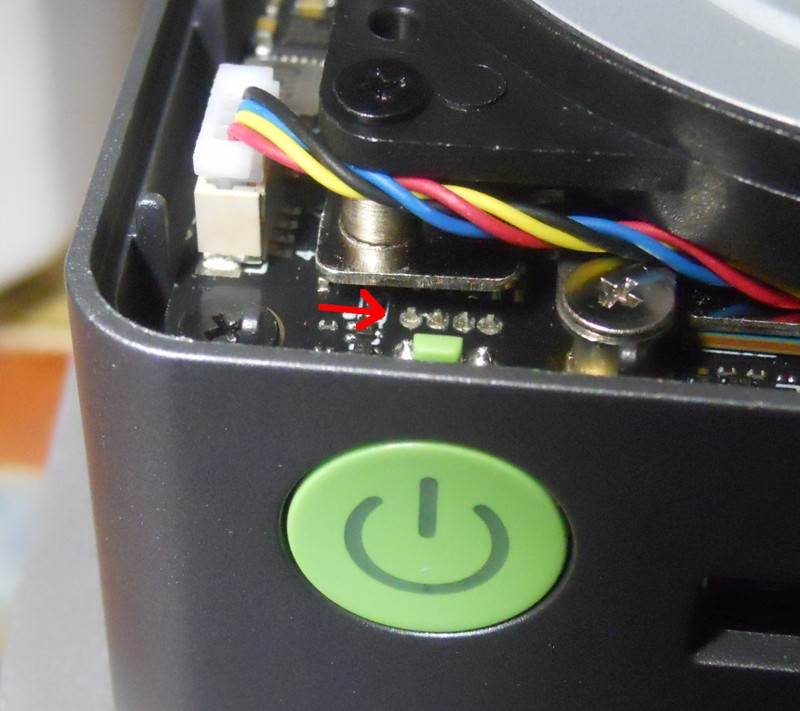
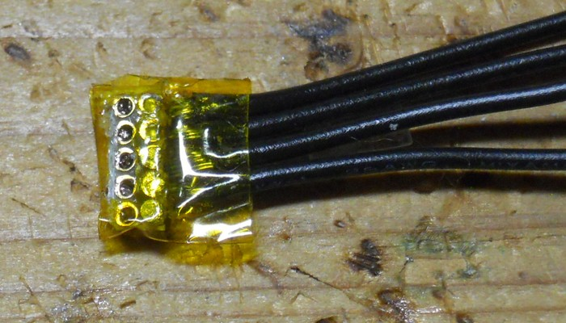
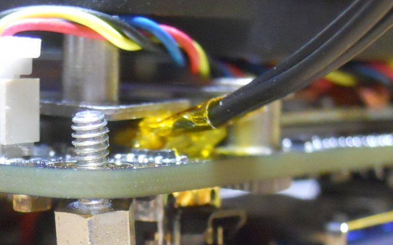
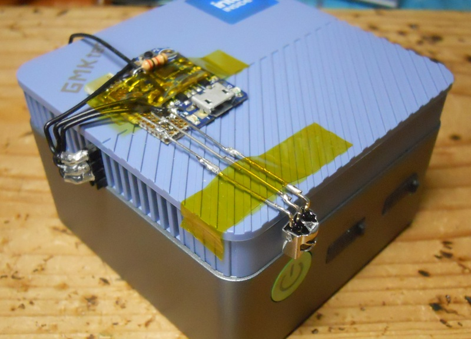

# IR power switch for mini PC

This project aims to power on mini PC by TV remote.

NucBox G5 expose power switch pins as indicated by red arrow in below image (2nd from right most pin is the power on pin).

Create a connector like below image.

I soldered 4 wires unthinkingly, but 1 wire would be enough.

Then tuck the connector to the space between mother board and fan platform.

Use multimeter to ensure pins are not short circuited.

Connect the other end of the connector to MCU with IR receiver and it's done.

You can use the USB port backside of G5 as a power source.

Now my G5 looks like this.

See [circuit/irswitch-sch.pdf](circuit/irswitch-sch.pdf) for the schematic.
